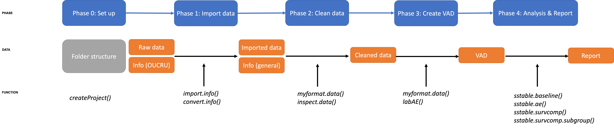

```{r setup, include = FALSE}
knitr::opts_chunk$set(
  collapse = TRUE,
  comment = "#>"
)
```

This vignette summarise one approach to data analysis pipeline and layouts how functions in this package fit to this pipeline.

{width=100%}
