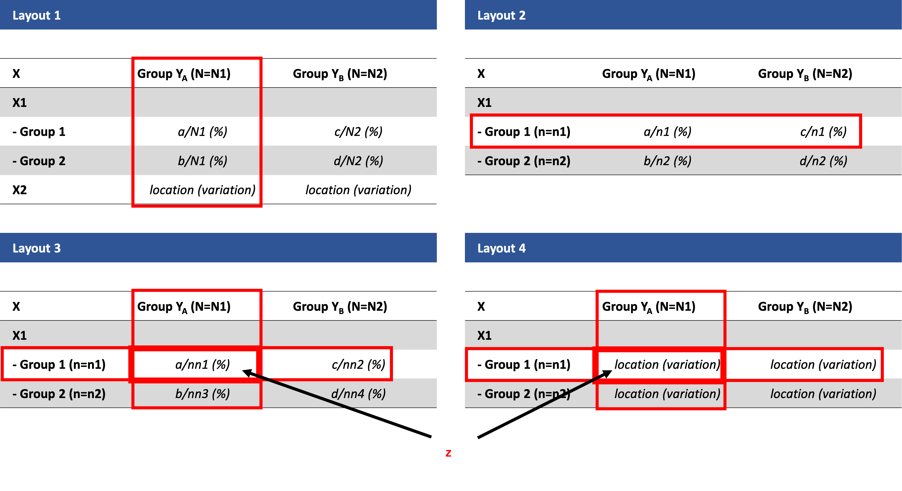

```{r setup, include = FALSE}
knitr::opts_chunk$set(
  collapse = TRUE,
  comment = "#>"
)
```

This vignette tries to explain how a formula to supply to function sstable.baseline() can be formulate.

## Basic types of table

A table can be used to display summary information of one or several variables. A specific table can summarize information of variable(s) X(s) on all subjects, by groups of variable Y, or summarize variable Z by variable X and variable Y. There are different ways these summaries statistics can be derived, depending on the existence and type of variables X, Y and Z. Figure 1 below summarizes 4 basic types of table and how to specify them using the sstable.baseline() function in this package:

{width=90%}

## Basic layouts of table

Figure 2 displays 4 basic layouts of table corresponding to 4 basic table types mentioned in Figure 1:

{width=90%}

